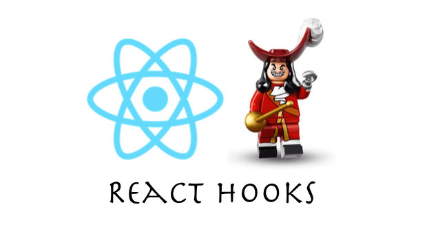

# Try React hooks

## :hammer: Install

```bash
# install dependencies
yarn

# serve with hot reload at localhost:3000
yarn dev

# build for production with minification
yarn deploy
```

## :boat: Demo(if not open use vpn)

https://awesome-react-hooks.netlify.com/

## :clap: Technical stack

- [React](https://reactjs.org/)
- [Next](https://github.com/segmentio/create-next-app/)
- [styled components](https://www.styled-components.com/)
- [styled-system](https://github.com/jxnblk/styled-system/tree/ab0242c981fa1d94d29f607a42a9e9a284dd452c)
- [yarn](https://yarnpkg.com/lang/en/)
- [node.js >= v8.9.4](https://nodejs.org/en/)

## Browser support

* Chrome (most recent 2 versions)
* Safari (most recent 2 versions)
* Opera (most recent 2 versions)